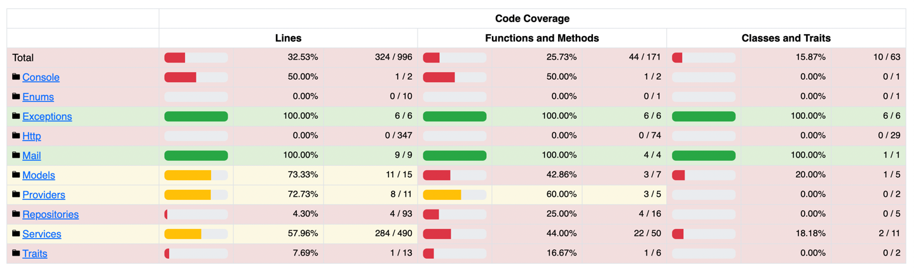

# Laravel Auth Application

Examples of OAuth2 authentication, Rate Limiting, 2fa.

## Features
- OAuth2 authentication (Client Credentials, Refresh Token, Authorization Code)
- 2fa (QR Code, Google Authenticator, Backup Codes)

## Getting Started

These instructions will guide you to run the project on your local machine for development and testing purposes.

### Prerequisites

Software required to run the project:

- Docker
- Docker Compose

### Installation and Running

1. Clone the project:
   ```
   git clone https://github.com/tmlsergen/laravel-auth.git
   ```
   ```
   cd laravel-auth
   ```
2. Create a copy of the `.env.example` file and rename it to `.env`:
   ```
   cp .env.example .env
   ```

3. Install Composer dependencies:
   ```
   make composer-install
   ```
   This command will run a Docker container and install the dependencies.

4. To run the application:
   ```
   make run-app
   ```

5. Install NPM dependencies:
   ```
   make npm-install
   ```
6. Migrate the database:
   ```
   make migrate
   ```

7. To stop the application:
   ```
   make stop-app
   ```

### Finally open your browser and go to http://localhost

## Users

- Admin
    - Email: admin@auth.com
    - Password: Test1234!

- User
    - Email: user@auth.com
    - Password: Test1234!

## Testing

To run the tests:
   ```
   make test
   ```

## Api Documentation

Generate the API documentation:
   ```
   make api-docs
   ```

Then open the browser and go to http://localhost/api/docs

## Test Coverage

Test Coverage Report:


